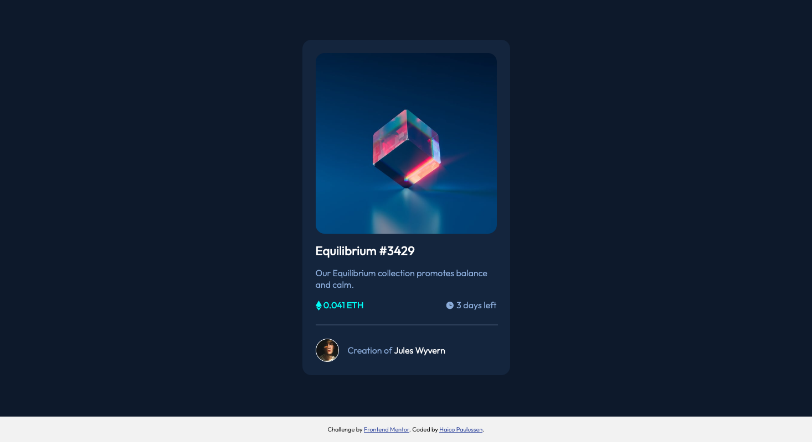

# Frontend Mentor - NFT preview card component solution

This is a solution to the [NFT preview card component challenge on Frontend Mentor](https://www.frontendmentor.io/challenges/nft-preview-card-component-SbdUL_w0U). Frontend Mentor challenges help you improve your coding skills by building realistic projects. 

## Table of contents

- [Overview](#overview)
  - [The challenge](#the-challenge)
  - [Screenshot](#screenshot)
  - [Links](#links)
- [My process](#my-process)
  - [Built with](#built-with)
  - [What I learned](#what-i-learned)
  - [Continued development](#continued-development)

- [Author](#author)

## Overview

### The challenge

Your challenge is to build out this preview card component and get it looking as close to the design as possible.

You can use any tools you like to help you complete the challenge. So if you've got something you'd like to practice, feel free to give it a go.

Your users should be able to:

- View the optimal layout depending on their device's screen size
- See hover states for interactive elements


### Screenshot



### Links

- Solution URL: [Front-End Mentor](https://www.frontendmentor.io/solutions/nft-card-with-css-grid-MzCs9hBfD)
- Live Site URL: [GitHub Pages](https://haico-paulussen.github.io/nft-card-css-grid/)

## My process

### Built with

- Semantic HTML5 markup
- CSS Grid
- Mobile-first workflow

### What I learned

We did this challenge with my collegues. It was very fun and quick to do. I got to use my CSS Grid knowledge again, so that was nice.

```css
.creator {
    display: grid;
    grid: 1fr / min-content 1fr;
    grid-gap: 1rem;
    align-items: center;
}  
```

### Continued development

So right now I learned basic HTML, CSS, Flexbox and CSS Grid. Next step for me is to start learning basic JavaScript so I can work on my long term goal: Learn VUE.js (and/or other frameworks).

## Author

- Frontend Mentor - [@Haico-Paulussen](https://www.frontendmentor.io/profile/Haico-Paulussen)
- LinkedIn - [Haico Paulussen](https://www.linkedin.com/in/haico-paulussen-160281158/)
